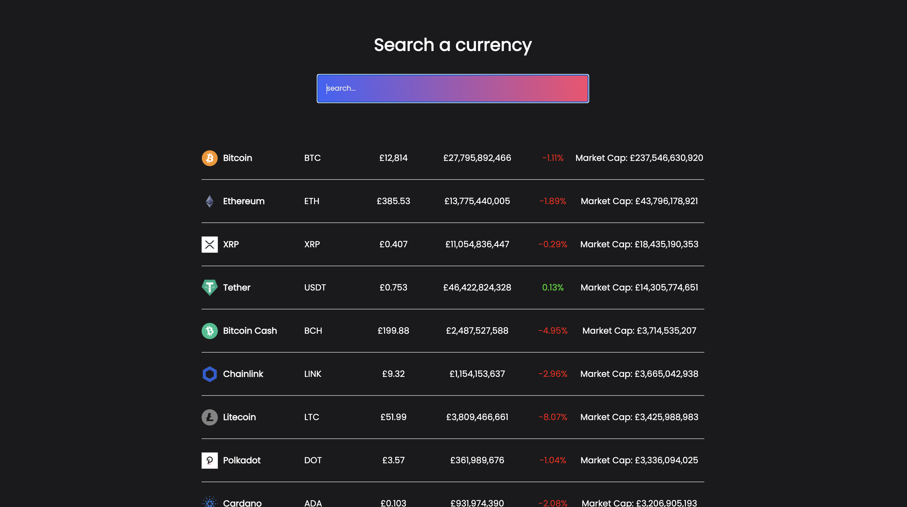

# Crypto Currency Tracker
[View the Demo here!](https://jamie-chandler.github.io/react-crypto-tracker/)

### What Is The Project?

This is a Crypto Currency tracking app, showing the Name, Symbol, Current Price, Volume, Percentage Change, and Market Cap of over 100 different crypto currencies.
The table of contents can be 'searched' for specific currencies.

### Built With

- [React.js](https://reactjs.org/)
- [CSS](https://developer.mozilla.org/en-US/docs/Learn/Getting_started_with_the_web/CSS_basics)
- [Coin Gecko API](https://www.coingecko.com/en/api)
- [Axios](https://github.com/axios/axios)

Why Axios?
Axios is a library that helps us make http requests to external resources. In this React applications, I needed to retrieve data from external APIs so it can be displayed in the web page. The link above explains the process on how to install Axios with both NPM, Bower, and Yarn. I use NPM for this project installations.

